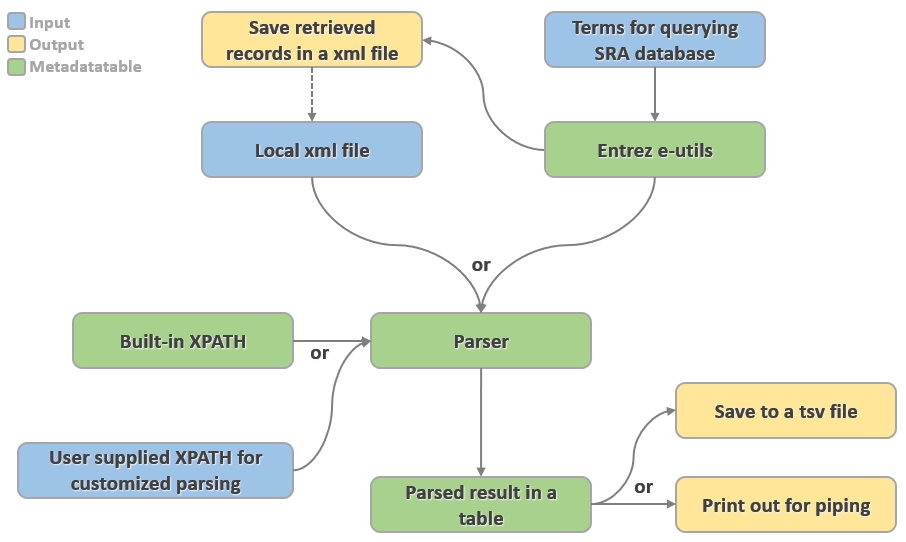

# MetadataTable
SRA Metadata is rich, sometimes too rich. There's no single standardized location for many types of useful information. This is a generalizable framework for pulling SRA metadata and summarizing usefully, with some common use-cases ready to go.

### What's the problem?
Even the type of study is heterogeneous for different submitters. The location of for instance tissue and developmental stage specifications within SRA metadata also varies, as do the values used to describe particular tissues.

### Why should we solve it?
Third-party efforts to load all metadata into a relational db suggest how widespread the problem is-- a customizable localized implementation helps many.

## Workflow


## Configuration

Requires python3 and python packages noted in requirements.txt

To get started, git clone to subdirectory MetadataTable, and create a working subdirectory named "testing" <br/>
``` virtualenv -p python3 testing 
 cd testing 
 source bin/activate 
 pip3 install -r ../MetadataTable/requirements.txt  
 python3 ../MetadataTable/metadatatable.py -h  
 ```

Please note that this a minimal implementation, quickly written; very few informative warning messages if problems are encountered

## Example Invocation

```
Retrieve all RNA-Seq datasets for taxon 7955, save output as a tab-delimited version :
python3 ../MetadataTable/metadatatable.py -e <your_email> -t "(biomol_transcript[properties] OR study_type_transcriptome_analysis[properties] OR strategy_rna_seq[properties] OR strategy_FL_cDNA[properties]) AND txid7955[Organism]" -ot 7955.tsv 
``` 

## Usage

```
>python metadatatable.py -h
usage: MetadataTable [-h] [-ox OUTPUT_XML] [-ot OUTPUT_TSV] [-i INPUT_XML]
                     [-e EMAIL] [-t TERM [TERM ...]] [-u] [-f] [-x XPATH]

optional arguments:
  -h, --help            show this help message and exit
  -ox OUTPUT_XML, --output_xml OUTPUT_XML
                        Path for saving xml file
  -ot OUTPUT_TSV, --output_tsv OUTPUT_TSV
                        Path for saving parsed file
  -i INPUT_XML, --input_xml INPUT_XML
                        Path to input file
  -e EMAIL, --email EMAIL
                        Let NCBI know who you are (required)
  -t TERM [TERM ...], --term TERM [TERM ...]
                        Query terms
  -u, --unlimited       Retrieve unlimited records
  -f, --full            Whether to output full table (Only for builtin template)
  -x XPATH, --xpath XPATH
                        Path to a csv file for xpath query
```

## Commands
**Input mode**

Users can choose which input mode they want. These two modes cannot be used together.

    -i input.xml
    Use a xml file as input.

    -e <your_email> -t searchterm
    Query Entrez using the terms specified by -t.

**Output mode**

Users can save both xml and tsv file, if filenames are given.  xml output can be large, it can be convenient to have a local copy while exploring which summary fields are informative.

    (blank)
    If no output mode specified, metadatatable will print out the parsed
    results.

    -ox output.xml
    Save downloaded records in a xml file.

    -ot output.tsv
    Save parsed records in a tsv file.

**Retrieval**

    -u
    Retrieve unlimited records. If not used, metadatatable will abort if
    the results from querying Entrez are more then 100,000

**Parsing**

    -f
    For built-in parsing template only. Output the full table. It will
    be silently ignored if using user supplied xpath file.

    -x xpath.csv
    If supplied, metadatatable will use read the xpath query from the
    specified csv file, and -c and -f will be silently ignored.
    
    -c case
    Use built-in parsing template. Choose from (rnaseq, source). Default
    is rnaseq. Note that "source" template is not implemented yet. This
    argument currently is ignored.

## Contributors

Tara Tufano <br/>
Lukas Wagner <br/>
Yadi Zhou
